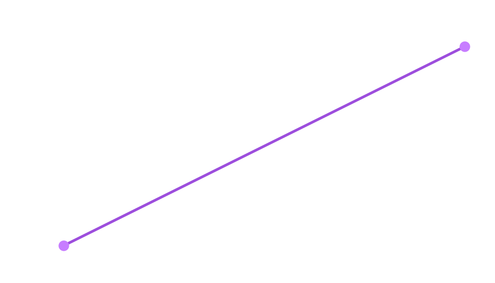

<!DOCTYPE html>
<html lang="en">

<head>
    <meta charset="UTF-8">
    <meta name="viewport" content="width=device-width, initial-scale=1.0">
    <title>Drone</title>
    <link rel="stylesheet" href="drone.css">
    <link rel="preconnect" href="https://fonts.googleapis.com">
    <link rel="preconnect" href="https://fonts.gstatic.com" crossorigin>
    <link
        href="https://fonts.googleapis.com/css2?family=Dancing+Script:wght@400..700&family=Outfit:wght@100..900&family=Poppins:ital,wght@0,100;0,200;0,300;0,400;0,500;0,600;0,700;0,800;0,900;1,100;1,200;1,300;1,400;1,500;1,600;1,700;1,800;1,900&display=swap"
        rel="stylesheet">
    <link rel="preconnect" href="https://fonts.googleapis.com">
    <link rel="preconnect" href="https://fonts.gstatic.com" crossorigin>
    <link
        href="https://fonts.googleapis.com/css2?family=Dancing+Script:wght@400..700&family=Outfit:wght@100..900&family=Poppins:ital,wght@0,100;0,200;0,300;0,400;0,500;0,600;0,700;0,800;0,900;1,100;1,200;1,300;1,400;1,500;1,600;1,700;1,800;1,900&family=Spline+Sans:wght@300..700&display=swap"
        rel="stylesheet">
        <link rel="preconnect" href="https://fonts.googleapis.com">
<link rel="preconnect" href="https://fonts.gstatic.com" crossorigin>
<link href="https://fonts.googleapis.com/css2?family=Dancing+Script:wght@400..700&family=Outfit:wght@100..900&family=Poppins:ital,wght@0,100;0,200;0,300;0,400;0,500;0,600;0,700;0,800;0,900;1,100;1,200;1,300;1,400;1,500;1,600;1,700;1,800;1,900&family=Special+Gothic:wght@400..700&family=Spline+Sans:wght@300..700&display=swap" rel="stylesheet">
<link rel="preconnect" href="https://fonts.googleapis.com">
<link rel="preconnect" href="https://fonts.gstatic.com" crossorigin>
<link href="https://fonts.googleapis.com/css2?family=Dancing+Script:wght@400..700&family=Outfit:wght@100..900&family=Poppins:ital,wght@0,100;0,200;0,300;0,400;0,500;0,600;0,700;0,800;0,900;1,100;1,200;1,300;1,400;1,500;1,600;1,700;1,800;1,900&family=Special+Gothic:wght@400..700&family=Spline+Sans:wght@300..700&display=swap" rel="stylesheet">
<link rel="preconnect" href="https://fonts.googleapis.com">
<link rel="preconnect" href="https://fonts.gstatic.com" crossorigin>
<link href="https://fonts.googleapis.com/css2?family=Bitcount+Grid+Double+Ink:wght@100..900&family=Dancing+Script:wght@400..700&family=Funnel+Sans:ital,wght@0,300..800;1,300..800&family=Outfit:wght@100..900&family=Poppins:ital,wght@0,100;0,200;0,300;0,400;0,500;0,600;0,700;0,800;0,900;1,100;1,200;1,300;1,400;1,500;1,600;1,700;1,800;1,900&family=Special+Gothic:wght@400..700&family=Spline+Sans:wght@300..700&display=swap" rel="stylesheet">
<link rel="preconnect" href="https://fonts.googleapis.com">
<link rel="preconnect" href="https://fonts.gstatic.com" crossorigin>
<link href="https://fonts.googleapis.com/css2?family=Bitcount+Grid+Double+Ink:wght@100..900&family=Dancing+Script:wght@400..700&family=Funnel+Sans:ital,wght@0,300..800;1,300..800&family=Outfit:wght@100..900&family=Poppins:ital,wght@0,100;0,200;0,300;0,400;0,500;0,600;0,700;0,800;0,900;1,100;1,200;1,300;1,400;1,500;1,600;1,700;1,800;1,900&family=Roboto:ital,wght@0,100..900;1,100..900&family=Special+Gothic:wght@400..700&family=Spline+Sans:wght@300..700&display=swap" rel="stylesheet">
</head>

<body>
    <!-- 

 -->
    

        <nav class="main">
            <ul>
                <li>Home </li>
                <li>Skills</li>
                <li>Qualification</li>
                <li>Contact</li>
            </ul>
        </nav>
    

    

        

            <!--  -->
        

    

    
    

        

        <h2>About Me</h2>

        
Assalamualaikum / Hi!   I'm Md Farhan, a second-year Electrical Engineering student at Zakir Husain College of Engineering and Technology, AMU.   I come from Bihar—the birthplace of Buddhism and Jainism, a land rich in culture and history.  

From a young age, I’ve been drawn to engineering because I love creating things and envisioning innovations that can improve lives.   Over time, my passion for creativity led me to explore graphic design, video editing, and photo editing. That curiosity naturally evolved into learning web development, especially UI/UX design, where I get to blend technical skills with visual storytelling.

I believe in building digital experiences that are not only functional but also engaging and user-friendly.   Whether it's designing interfaces or crafting visuals for outreach, I enjoy contributing to teams where creativity meets purpose.

        

            <!--  -->
        

    

    

        <h7 style="font-size: 25px;">Projects</h7>

        
Now due to some reason not able to showcase all my project but i will slowly add all.

        

            

                 
                 
Drone- Assembling & Flying 

                

        

            
        
drone
 

        

        

        

        

        

        

      
        

    

    

    

    

    

    
    

    

    

    

    <!-- 

        

            Engineer
            Graphic Designer
            Coder
            Engineer
            coder
            <!-- Graphic Designer
      Engineer
      Graphic designer
      Coder -->

        
 -->
    

    

        <h1>*Technical Skills*</h1>
        

            
Graphic Designer

            
HTML

            
CSS

            
JavaScript

            
C(language)

            <!-- 
web
 -->
            <!-- 
web
 -->
            <!-- 
web
 -->
        

    

    

        
        
Zakir Husain College of Engineering and Technology

    

    
    
    
    
    
    
    
    
    
    
    
    
    
    
    
    
    

    

        <p1>Welcome to my portfolio</p1>
        <h3>Hi, My name is</h3>
        <h4>Md Farhan</h4>

    

    

        

            

                
            

        

    

    

        <!--  -->
    

    

        <!--  -->
    

    

        
    

    

Md Farhan

        <p3>Electrical Engg. student at Zakir Husain College of Engineering.  
        (Worked As Freelancer at Fiverr,Freelancer.in etc )</p3>
    

    
THANK YOU FOR VISITING...

    

    

        

       
            
            
            
            
    

        

        

            Loading... New Experiences!!!
        

          

        
PALESTINE IN OUR HEARTS

</body>

</html>
